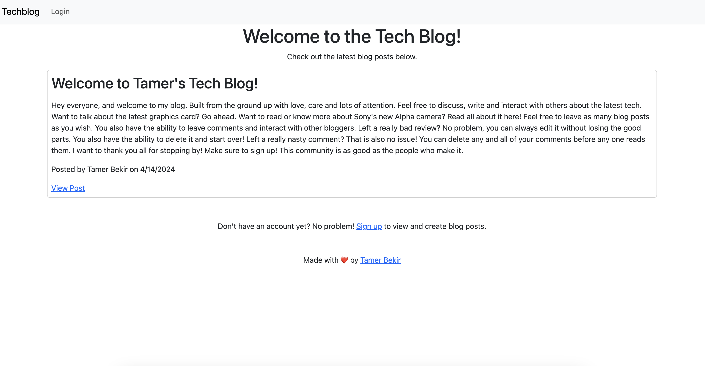
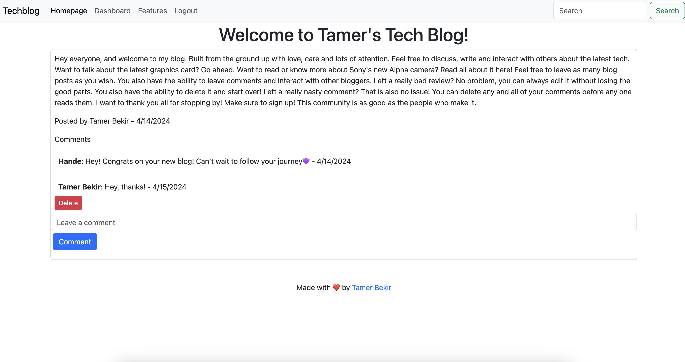
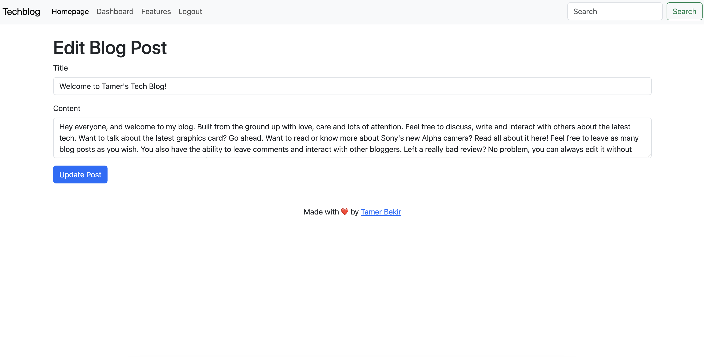
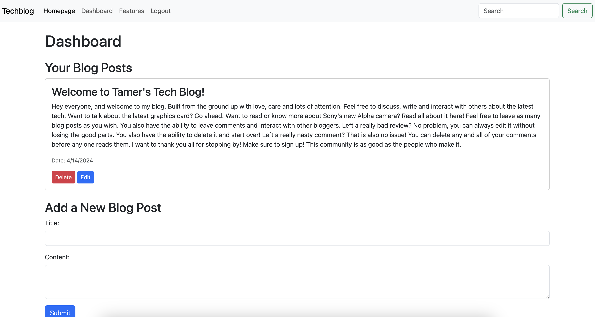

# Model View Controller MVC TechBlog

## Description 

Welcome to Tamer's Tech Blog!

A blog created for users to talk and read about the latest tech. When a user visits the Tech Blog they will be greeted with a homepage, where they will be able to read the latest blog posts from users. However, if a user wishes to view a blog post's content, such as the comments, or wishes to leave a comment themselves, they will have to log in or sign up. 

The Tech Blog is equipped with a login and or sign-up page. A user can sign up using a unique username, email, and password verification. A user will be prompted if they do not meet the criteria. The user's passwords are protected using bycrypt. Once they sign up, their user information will be stored in the database- which means the user can log in and out as much as they want. 

Once user log in or sign up they will be brought to their dashboard. On the dashboard, a user will have the ability to create as many blog posts as they want (up to 2000 characters!). From the dashboard, a user can also edit or delete the blog posts they have created. Once a user posts a new blog or edits an existing one, it will be rendered to the homepage, where all users can view it.

All blog posts from all users will be rendered to the homepage. If a user is logged in, they can view a blog post, and leave comments. The comments are tied to the individual user, so only the user who created the comments can delete them.  

The Tech Blog is also equipped with a 404 page, which will be displayed if a user tries to access a page that does not exist. For example, if a user tries to go to a direct link to a blog post, but that blog post does not exist, they will be redirected to the 404 page. Or, if the user attempts to access a page that does not belong to them (such as trying to edit a post they do not own), the user will be prompted to a 404 page.

Lastly, The Tech Blog features a coming soon tab, to let all the users know the blog is still under construction and that there is so much more to come!

# Table of Contents
- [Description](#description)
- [Installation](#installation)
- [Usage](#usage)
- [Link](#link)
- [Screenshot](#screenshot)
- [Questions](#questions)
- [License](#license)

## Screenshot

 

## Usage

This application uses the following technologies:

- <a href="https://nodejs.org/en"> Node.js</a>
- <a href="https://expressjs.com/"> Express.js</a>
- <a href="https://www.mysql.com/"> MySQL</a>
- <a href="https://sequelize.org/"> Sequelize</a>
- <a href="https://handlebarsjs.com/"> Handlebars</a>
- <a href="https://www.npmjs.com/package/bcrypt"> Bcrypt</a>
- <a href="https://www.npmjs.com/package/express-session"> Express-session</a>
- <a href="https://www.npmjs.com/package/connect-session-sequelize"> Connect-session-sequelize</a>
- <a href="https://www.npmjs.com/package/dotenv"> Dotenv</a>

## Link

<a href="https://tamers-techblog-7d9d9db3bd10.herokuapp.com/">The Tech Blog</a>

## Questions

<a href="https://github.com/tamerbekir">My GitHub</a>

If you have any questions or inquiries, feel free to contact me using my <a href="mailto:tamerbekir@yahoo.com">tamerbekir@yahoo.com</a>

This <a href="https://github.com/Tamerbekir/tamer-readme-generator">README.md</a> was generated by <a href="https://github.com/Tamerbekir">Tamer Bekir</a> using Node.js.

## License

This project is covered under the [MIT License](https://opensource.org/blog/license/mit) License
